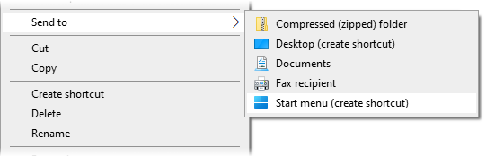
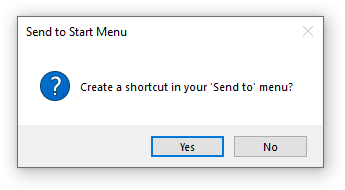

# Send to Start Menu



*Send to Start Menu* is a program for Windows that makes it easier to manually add programs to the Start menu. It adds a 'Start menu (create shortcut)' option to your `Right Click -> Send to` menu, similar to the built in 'Desktop (create shortcut)' option. It will also try to automatically detect the name of the selected program using the metadata inside the EXE and name the shortcut accordingly.

## Download

A bundled EXE file can be found on the [Releases page](https://github.com/ColouMods/Send-to-Start-Menu/releases).

### Usage

Simply extract the EXE to a safe folder somewhere and run it. It'll then prompt you with this message:



Pressing 'Yes' will add a shortcut to the the program to your 'Send to' menu. Note that moving or deleting the EXE file will break the shortcut, and you will need to run the program again.

## Running from Source

### Prerequisites

You will need to have [Python](https://www.python.org/) installed in order to run from source.

You will also need to install the Python package [pywin32](https://pypi.org/project/pywin32/), as this is used to access the Windows APIs:
```
pip install pywin32
```

### Usage

The program can be added to the 'Send to' menu by running it like so:
```
pythonw SendToStartMenu.pyw
```

From there, it will work exactly like the bundled EXE version.

However, an important note is that **the program won't work running under the Windows Store version of Python**, since that version is unable to access the user's Local AppData folder (which is where the Start menu shortcuts are stored).

## Building the EXE

You will need to install [PyInstaller](https://pyinstaller.org/) in order to create the bundled EXE:
```
pip install pyinstaller
```

The bundled EXE in [Releases](https://github.com/ColouMods/Send-to-Start-Menu/releases) is built with the following command:
```
pyinstaller --onefile --icon=icon.ico SendToStartMenu.pyw
```